# Development Plan: ResumeForge

## 1. Mentorship Approach & Execution Rules

To ensure a structured learning experience and maintain high code quality, we will build **ResumeForge** incrementally.

### Key Rules of Engagement
1. **Step-by-Step Implementation**: We will build one feature module at a time. No jumping ahead.
2. **Implementation Plan First**: Before writing or modifying any code in a step, we will create/review an explicit plan outlining the files to touch and changes to make.
3. **No Unnecessary Libraries**: Maintain a clean, minimalist dependency list.
4. **Mandatory Runtime Verification**: Every step must be verified with tests (`pytest`, endpoint execution, or interactive validation) before marking complete.
5. **Clear Technical Explanations**: Architectural decisions and concepts (JWT, ORM sessions, Pydantic validation, CORS, Docker networking) will be explained clearly.

---

## 2. Phased Development Roadmap

```mermaid
flowchart LR
    P0["Phase 0: Environment & Health API"] --> P1["Phase 1: DB & Migrations"]
    P1 --> P2["Phase 2: Auth, JWT & Test DB"]
    P2 --> P3["Phase 3: Resume API & Import/Export"]
    P3 --> P4["Phase 4: Frontend Auth UI"]
    P4 --> P5["Phase 5: Builder & Live Preview"]
    P5 --> P6["Phase 6: Print View & PDF Export"]
    P6 --> P7["Phase 7: Docker & Migration Entrypoint"]
    P7 --> P8["Phase 8: Deployment & Review"]
```

---

### Phase 0: Project Setup & Environment Configuration
- **Objective**: Establish project directory structure, Git repository, Python virtual environment, dependencies, environment variable validation, and local Docker setup for PostgreSQL.
- **Deliverables**:
  - Python virtual environment (`.venv`).
  - `requirements.txt`: `fastapi`, `uvicorn`, `sqlalchemy`, `psycopg2-binary`, `alembic`, `pydantic`, `pydantic-settings`, `python-jose`, `passlib[bcrypt]`, `pytest`, `httpx`.
  - `.env.example` & Pydantic `BaseSettings` class (`app/core/config.py`).
  - `docker-compose.yml` for local PostgreSQL database.
  - Basic FastAPI app skeleton with `/api/v1/health` endpoint.
- **Verification**: Run FastAPI server locally and execute GET request to `/api/v1/health` returning `{"status": "ok"}`. Verify PostgreSQL container status.

---

### Phase 1: Database Architecture & Alembic Migrations
- **Objective**: Configure synchronous SQLAlchemy database engine, session management, declarative models base, and initialize Alembic.
- **Deliverables**:
  - `app/db/session.py`: Synchronous engine (`create_engine`) and `sessionmaker`.
  - `app/db/base.py`: Base declarative model class.
  - Initialized Alembic migration environment (`alembic init`).
  - Script verifying PostgreSQL connectivity.
- **Verification**: Run database connectivity verification script and generate initial baseline migration.

---

### Phase 2: User Authentication, Security & Test Database Setup
- **Objective**: Build User models, password hashing, JWT security, Auth API routes (Register, Login, Me, Password Change), and configure isolated test database fixtures.
- **Deliverables**:
  - `User` model & Pydantic schemas (`UserCreate`, `UserResponse`, `Token`, `PasswordChange`).
  - Password length validation (minimum 8 characters) and bcrypt hashing in `app/core/security.py`.
  - Auth dependencies (`get_current_user`) and rate-limiting helper.
  - Auth routes: `/api/v1/auth/register`, `/api/v1/auth/login`, `/api/v1/auth/me`, `/api/v1/auth/password`.
  - Isolated test configuration in `conftest.py` reading `TEST_DATABASE_URL`.
- **Verification**: Execute `pytest` test suite verifying user registration, login, token verification, password change, and invalid login rejection using the isolated test database.

---

### Phase 3: Resume Core Data Models & CRUD API Endpoints
- **Objective**: Build SQLAlchemy models for `Resume`, `PersonalInfo`, `WorkExperience`, `Education`, `Skill`, `Project`, `Certification`, `CustomSection`, and expose full payload sync API endpoints.
- **Deliverables**:
  - SQLAlchemy relational models with CASCADE deletions.
  - Pydantic schemas for nested full resume payload, including `custom_sections` and `section_order`.
  - Row-level authorization dependency (`verify_resume_owner`).
  - CRUD API routes:
    - `GET /api/v1/resumes`
    - `POST /api/v1/resumes`
    - `GET /api/v1/resumes/{id}`
    - `PUT /api/v1/resumes/{id}` (Full payload sync)
    - `DELETE /api/v1/resumes/{id}`
    - `POST /api/v1/resumes/{id}/duplicate`
    - `POST /api/v1/resumes/import`
    - `GET /api/v1/resumes/{id}/export/json`
  - Migration script for resume models (`alembic revision --autogenerate`).
- **Verification**: Run `alembic upgrade head`. Execute `pytest` test suite for full payload sync, custom section persistence, ownership checks, JSON import, and JSON export.

---

### Phase 4: Frontend Foundation & Authentication UI
- **Objective**: Create static file structure, CSS styles, JavaScript API client (`api.js`), and user authentication pages.
- **Deliverables**:
  - Static file layout (`static/css`, `static/js`, `static/pages`).
  - `api.js`: Fetch client handling JWT bearer headers, error responses, and token storage.
  - `login.html` & `register.html` with responsive styles.
  - Auth state navigation checks.
- **Verification**: Interactively test user registration and login in browser. Verify JWT storage in `localStorage`.

---

### Phase 5: Resume Builder Interface & Real-time Live Preview
- **Objective**: Construct the interactive resume editor UI featuring dynamic multi-section form inputs (including Custom Sections), JSON import file picker, and real-time live preview.
- **Deliverables**:
  - `dashboard.html`: List resumes with options to edit, duplicate, export, import JSON, or delete.
  - `builder.html`: Split-screen layout (Editor form on left, Live preview on right).
  - Dynamic controls for adding/removing standard items and Custom Sections.
  - Resume template styles (`modern.css`, `classic.css`, `minimalist.css`).
  - JSON File Import button wired to `POST /api/v1/resumes/import`.
- **Verification**: Build a resume with custom sections in browser, preview live updates, import a JSON backup, and confirm auto-save sync with backend API.

---

### Phase 6: PDF Print View & Data Export
- **Objective**: Build dedicated HTML print view endpoint (`GET /api/v1/resumes/{id}/print`) and implement print CSS rules for clean PDF rendering.
- **Deliverables**:
  - `GET /api/v1/resumes/{id}/print` returning clean HTML rendered without editor controls.
  - CSS print stylesheet (`@media print`, `@page { size: A4 portrait; margin: 12mm; }`, `break-inside: avoid`).
  - PDF Export button triggering `window.print()`.
- **Verification**: Test print view rendering and execute print-to-PDF in browser, confirming no broken section page breaks or visible UI buttons.

---

### Phase 7: Docker Containerization & Migration Entrypoint Strategy
- **Objective**: Containerize FastAPI backend with Docker and configure Docker Compose multi-container orchestrations with an automated database migration startup script.
- **Deliverables**:
  - `Dockerfile` for Python FastAPI backend.
  - `entrypoint.sh` executing `alembic upgrade head` before Uvicorn starts.
  - `docker-compose.yml` with `backend` and `db` services, environment variables, healthchecks, and entrypoint binding.
- **Verification**: Run `docker compose up --build`. Verify PostgreSQL healthcheck passes, Alembic migrations run automatically on startup, and `/api/v1/health` responds cleanly.

---

### Phase 8: Deployment Readiness & Final Walkthrough
- **Objective**: Conduct security audit, verify environment configuration, and create cloud deployment guide.
- **Deliverables**:
  - Finalized `.env.example`.
  - Deployment guide for cloud platforms (e.g. Render, Railway, AWS EC2).
  - End-to-end system verification walkthrough.
- **Verification**: Execute full system verification test suite.
