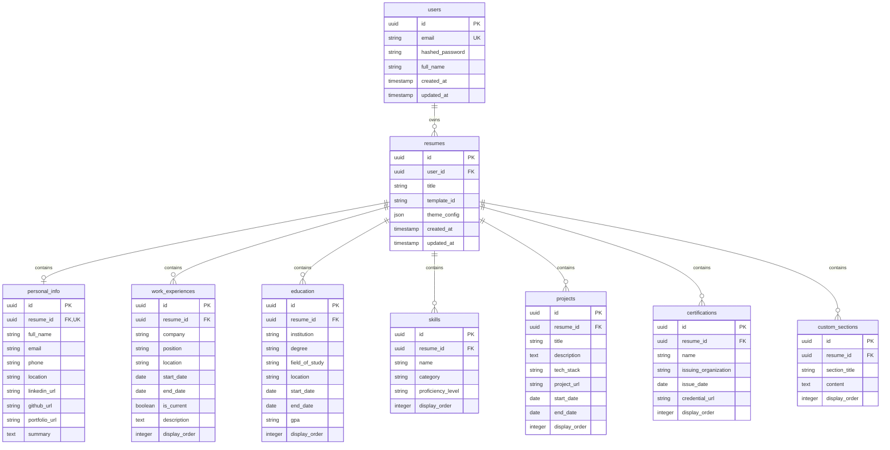
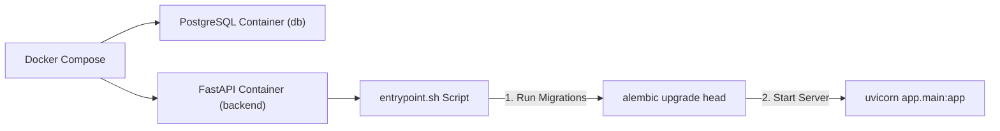

# System Design: ResumeForge

## 1. High-Level Architecture Overview

ResumeForge follows a decoupled **Client-Server Architecture** communicating via a RESTful API.

```mermaid
flowchart TD
    subgraph Client ["Frontend (Browser)"]
        UI ["HTML5 / CSS3 Interface"]
        JS ["Vanilla JS App / State Engine"]
        Preview ["Live Preview Component"]
        PrintView ["Dedicated Print View"]
    end

    subgraph API ["Backend Service (FastAPI)"]
        Router ["API Routers / Controllers"]
        Auth ["JWT & Row-Level Authorization"]
        Services ["Business Logic Layer"]
        ORM ["SQLAlchemy 2.0 (Sync Engine)"]
    end

    subgraph Storage ["Database Layer"]
        DB [("PostgreSQL Database")]
    end

    UI -->|User Events| JS
    JS -->|Re-render| Preview
    JS <-->|JSON over HTTP / REST| Router
    PrintView -->|Window Print Dialog| Client
    Router --> Auth
    Auth --> Services
    Services --> ORM
    ORM <-->|SQL Queries / Connection Pool| DB
```

---

## 2. Database Schema & Data Models

ResumeForge uses a normalized relational database schema in **PostgreSQL**. A `User` can have multiple `Resumes`, and each `Resume` owns child section entries linked via foreign keys with cascading deletions.

### 2.1 Entity Relationship Diagram (ERD)



---

## 3. Database Table Definitions

### `users`
- `id`: UUID (Primary Key, default auto-generated UUIDv4)
- `email`: VARCHAR(255) (Unique, Indexed, Not Null)
- `hashed_password`: VARCHAR(255) (Not Null)
- `full_name`: VARCHAR(100) (Not Null)
- `created_at`: TIMESTAMP WITH TIMEZONE (Default `now()`)
- `updated_at`: TIMESTAMP WITH TIMEZONE (Default `now()`)

### `resumes`
- `id`: UUID (Primary Key)
- `user_id`: UUID (Foreign Key `users.id` ON DELETE CASCADE, Indexed)
- `title`: VARCHAR(150) (Not Null)
- `template_id`: VARCHAR(50) (Default `'modern'`)
- `theme_config`: JSONB (Stores primary color, font family, margins, and `section_order` list)
- `created_at`: TIMESTAMP WITH TIMEZONE
- `updated_at`: TIMESTAMP WITH TIMEZONE

### `personal_info`
- `id`: UUID (Primary Key)
- `resume_id`: UUID (Foreign Key `resumes.id` ON DELETE CASCADE, Unique)
- `full_name`: VARCHAR(100)
- `email`: VARCHAR(255)
- `phone`: VARCHAR(50)
- `location`: VARCHAR(100)
- `linkedin_url`: VARCHAR(255)
- `github_url`: VARCHAR(255)
- `portfolio_url`: VARCHAR(255)
- `summary`: TEXT

### `work_experiences`, `education`, `skills`, `projects`, `certifications`
Follow standard relational structures linked to `resume_id` via CASCADE deletion, with `display_order` fields for UI section re-ordering.

### `custom_sections`
- `id`: UUID (Primary Key)
- `resume_id`: UUID (Foreign Key `resumes.id` ON DELETE CASCADE)
- `section_title`: VARCHAR(150) (Not Null)
- `content`: TEXT (Markdown or bullet points)
- `display_order`: INTEGER (Default `0`)

---

## 4. API Endpoints Specification

All API endpoints are prefixed with `/api/v1`. Authenticated routes require header: `Authorization: Bearer <JWT_TOKEN>`.

### 4.1 System & Auth API (`/health`, `/auth`)

| Method | Endpoint | Auth Required | Description | Request Body | Response |
| :--- | :--- | :--- | :--- | :--- | :--- |
| `GET` | `/health` | No | Health check probe for Docker/Cloud | None | `200 OK` + `{"status": "ok"}` |
| `POST` | `/auth/register` | No | Register a new user | `{ email, password, full_name }` | `201 Created` + User Object |
| `POST` | `/auth/login` | No | Authenticate user & get JWT token | `{ email, password }` | `200 OK` + `{ access_token, token_type }` |
| `GET` | `/auth/me` | Yes | Get current user profile | None | `200 OK` + User Object |
| `PUT` | `/auth/password` | Yes | Change account password | `{ current_password, new_password }` | `200 OK` + Message |

### 4.2 Resume Management API (`/resumes`)

| Method | Endpoint | Auth Required | Description | Response |
| :--- | :--- | :--- | :--- | :--- |
| `GET` | `/resumes/` | Yes | List all resumes owned by logged-in user | `200 OK` + Array of Resume summaries |
| `POST` | `/resumes/` | Yes | Create a new empty resume document | `201 Created` + Resume Object |
| `GET` | `/resumes/{id}` | Yes | Fetch complete resume with all nested sections | `200 OK` + Full Resume Payload |
| `PUT` | `/resumes/{id}` | Yes | Full payload update (theme, sections, content) | `200 OK` + Updated Resume |
| `DELETE` | `/resumes/{id}` | Yes | Delete resume and all associated sections | `204 No Content` |
| `POST` | `/resumes/{id}/duplicate` | Yes | Clone existing resume into a new document | `201 Created` + New Cloned Resume |
| `POST` | `/resumes/import` | Yes | Import JSON file payload to create a resume | `201 Created` + Imported Resume |
| `GET` | `/resumes/{id}/export/json` | Yes | Export complete resume as downloadable JSON | `200 OK` + JSON File Attachment |
| `GET` | `/resumes/{id}/print` | Yes | Dedicated HTML view optimized for browser print/PDF | `200 OK` + Clean HTML Document |

---

## 5. Architectural & Technical Decisions

### 5.1 Persistence Strategy: Full Object Sync
- **Chosen Approach**: **Full Resume JSON Payload Sync (`PUT /resumes/{id}`)**.
- **Implementation**: The backend receives the full consolidated resume payload containing `title`, `template_id`, `theme_config`, `personal_info`, `work_experiences`, `education`, `skills`, `projects`, `certifications`, and `custom_sections`.
- **Database Execution**: Executed within a single database transaction. Child records are synchronized atomically, ensuring consistent state without partial updates.

### 5.2 ORM & Session Architecture: Synchronous SQLAlchemy 2.0
- **Chosen Engine**: Standard synchronous SQLAlchemy 2.0 engine using `psycopg2-binary`.
- **Rationale**: Keeps database connection handling simple, reliable, and beginner-friendly while integrating smoothly with FastAPI route handlers and Alembic migrations.

### 5.3 Security & Row-Level Authorization
- **JWT Authentication**: Signed with `SECRET_KEY` using `HS256` algorithm.
- **Row-Level Authorization**: A central FastAPI dependency helper (`verify_resume_owner`) checks that `resume.user_id == current_user.id` on every operation. Unauthorized access yields `403 Forbidden` or `404 Not Found`.
- **Environment Validation**: Managed using Pydantic `BaseSettings` reading from `.env`. Missing required variables cause immediate startup failure.

### 5.4 PDF Generation & Print CSS Architecture
- **Print View Route**: `GET /api/v1/resumes/{id}/print` serves a standalone HTML representation rendered without editor UI sidebars or buttons.
- **Print CSS Rules**:
  ```css
  @page {
    size: A4 portrait;
    margin: 12mm;
  }
  @media print {
    body { background: #ffffff; color: #000000; }
    .no-print { display: none !important; }
    .section-block { break-inside: avoid; page-break-inside: avoid; }
  }
  ```
- **Trigger**: Client invokes `window.print()` directly from the print preview tab.

---

## 6. Docker Containerization & Deployment Strategy



- **Database Healthcheck**: `pg_isready` verifies Postgres availability before backend launches.
- **Automated Migrations**: `entrypoint.sh` runs `alembic upgrade head` automatically upon container startup, guaranteeing database schema synchronization prior to serving HTTP traffic.
